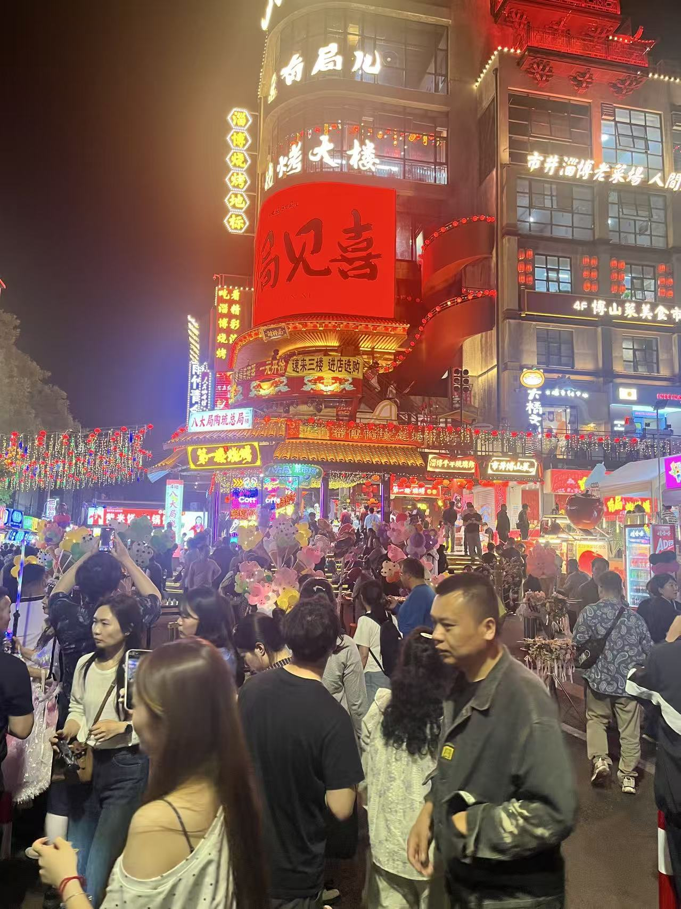

# 【Skill 创作】你一生的故事 - 让照片讲述生命旅程

## 1、Skill简介

这是一个能够将场景照片转化为人生故事叙述的 Skill，帮助每个人记录下独特的生命旅程。它从特定人物视角出发，用富有情感的文字描述照片，将珍贵瞬间转化为永恒的故事记忆。

## 2、使用场景

### 为什么想做它？

每个人的一生都是一个故事，关于走过的旅程，经历的战斗，感受的苦恼和困惑。但是，大多数人的故事没有记录下来，随着日子湮没了。他们自己不会写，也不会有人帮他们写。

### 之前遇到了什么麻烦？

- 翻看老照片时，很多回忆已经模糊，无法完整讲述背后的故事
- 想要为家人记录人生故事，但缺乏写作能力或时间
- 照片只是静态图像，无法传递当时的情感和氛围

### 做出来之后能省掉哪些动作？

- 不再需要绞尽脑汁回忆照片背后的故事
- 无需花费大量时间学习写作技巧
- 一键将照片转化为富有电影感的叙述文字
- 轻松为家庭档案、旅行纪念、人生里程碑创建故事记录

## 3、创作过程

### 灵感来源

这个 Skill 的灵感来源于特德·姜的科幻小说《你一生的故事》。小说中语言学家通过学习外星语言获得了预知未来的能力，从而看到了女儿完整的一生。这个书名让我念念不忘——每个人的生命都值得被讲述。

### 使用 SOLO 的创作步骤

1. **定义核心功能**：确定 Skill 的核心是将照片描述转化为人生故事叙述
2. **设计角色定位**：设定专业电影旁白叙述者的角色，具备场景分析和情感投射能力
3. **制定叙述规则**：确立第三人称视角、真实性原则、情感平衡等叙述准则
4. **构建工作流程**：信息收集 → 深度观察 → 叙事创作 → 情感升华
5. **编写示例场景**：创建日常场景、人物互动、工作场景等多种示例

### 关键配置

```yaml
name: "你一生的故事"
description: "将照片转化为人生故事叙述，记录每个人独特的生命旅程"
```

### 叙述结构设计

- **时间/场景引入** - 建立照片的时间和空间背景
- **画面描述** - 详细描述照片中的场景和人物
- **情感投射** - 通过叙事者视角传达情感
- **人生感悟** - 融入对生命旅程的思考

## 4、使用步骤

### 第一步：提供基本信息

调用 Skill 时需要提供以下信息：

- **叙事者姓名**：故事的主角姓名（如：张三、牛飞飞）
- **叙事者年龄**：当前年龄（如：20岁、29岁）
- **所在城市**：生活地点（如：上海、北京）
- **照片描述**：需要描述的场景照片内容或上传照片

### 第二步：获取叙述结果

Skill 会自动生成一段专业电影旁白式的叙述文字，包含场景描绘、人物刻画、情感投射和人生感悟。

### 使用示例

**输入**：

- 叙事者：牛飞飞
- 年龄：29岁
- 城市：淄博
- 照片：八大局夜市夜景

**输出**：

> 在五月一日这个充满烟火气的夜晚，牛飞飞站在了淄博八大局的街头。霓虹灯光将整座"烤大楼"映照得如同一块巨大的琥珀，"局见喜"三个大字在夜色中散发着温暖的光芒...

## 5、效果展示

### 使用前

你有一张珍贵的照片，但不知道如何用文字描述它的意义，只能简单说："这是我在淄博拍的照片"。

### 使用后

Skill 为你生成一段富有情感的叙述：

> 人群在街道上缓缓流动，每一张面孔都带着节日特有的兴奋和期待。有人举起手机记录着这热闹的瞬间，有人在摊位前驻足挑选，空气中似乎都弥漫着烧烤的香气和人群的欢声笑语。
>
> 牛飞飞穿行在人群中，感受着这份独属于淄博的热闹与真诚。这不仅仅是一次简单的旅行，更是一次对生活本质的触摸——在这喧嚣的尘世中，人们用食物、用欢笑、用相聚，编织着属于自己的幸福时光。

### 效果对比图

- 使用前
  
  _使用前：只是一张静态照片_

- 使用后:照片变成了有温度的故事

```
在五月一日这个充满烟火气的夜晚，牛飞飞站在了淄博八大局的街头。

霓虹灯光将整座"烤大楼"映照得如同一块巨大的琥珀，"局见喜"三个大字在夜色中散发着温暖的光芒，像是在迎接每一位远道而来的客人。街道两旁的店铺招牌此起彼伏，红的、黄的、蓝的灯光交织在一起，勾勒出一幅生动的人间烟火图。

人群在街道上缓缓流动，每一张面孔都带着节日特有的兴奋和期待。有人举起手机记录着这热闹的瞬间，有人在摊位前驻足挑选，空气中似乎都弥漫着烧烤的香气和人群的欢声笑语。

牛飞飞穿行在人群中，感受着这份独属于淄博的热闹与真诚。这不仅仅是一次简单的旅行，更是一次对生活本质的触摸——在这喧嚣的尘世中，人们用食物、用欢笑、用相聚，编织着属于自己的幸福时光。
```

## 6、Skill 链接

- **Skill 分享链接**：[点击获取](https://github.com/Codeniu/skills/blob/main/你一生的故事/SKILL.md)
- **说明文档**：[README.md](https://github.com/Codeniu/skills/blob/main/你一生的故事/README.md)
- **GitHub 仓库**：[https://github.com/Codeniu/skills.git](https://github.com/Codeniu/skills.git)

## 7、总结与思考

### 收获与感悟

创建这个 Skill 的过程让我深刻体会到：

1. **效率提升**：原本需要花费半小时甚至更长时间构思和写作的照片描述，现在只需几分钟即可完成
2. **情感价值**：AI 不仅能提高效率，还能捕捉和传递人类情感，让冰冷的图像变得有温度
3. **生命意义**：每个人的故事都值得被记录，这个 Skill 让普通人也能拥有属于自己的人生故事集

### 最满意的地方

最满意的是 Skill 能够准确把握照片的情感基调，并用富有诗意的语言表达出来。它不仅仅是描述画面，更是在讲述一个完整的故事。

### 后续优化方向

1. **多语言支持**：增加英文、日文等多语言叙述能力
2. **语音合成**：将文字叙述转化为语音旁白
3. **故事集功能**：支持批量处理多张照片，自动生成连贯的人生故事集
4. **主题模板**：增加亲情、友情、爱情、事业等主题模板供用户选择

### 希望得到的建议

1. 你觉得这个 Skill 最适合哪些场景使用？
2. 叙述风格是否需要调整（更文艺/更简洁/更幽默）？
3. 是否需要增加更多定制化选项？
4. 有什么功能是你特别期待的？

---

如果你喜欢这个 Skill，欢迎体验并给出反馈！让我们一起为每个人的一生留下最美的注脚。
